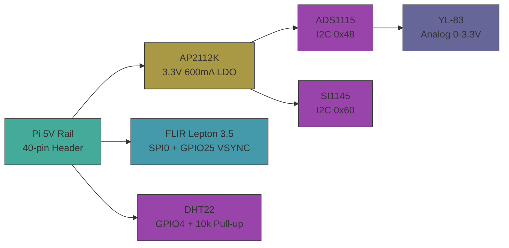
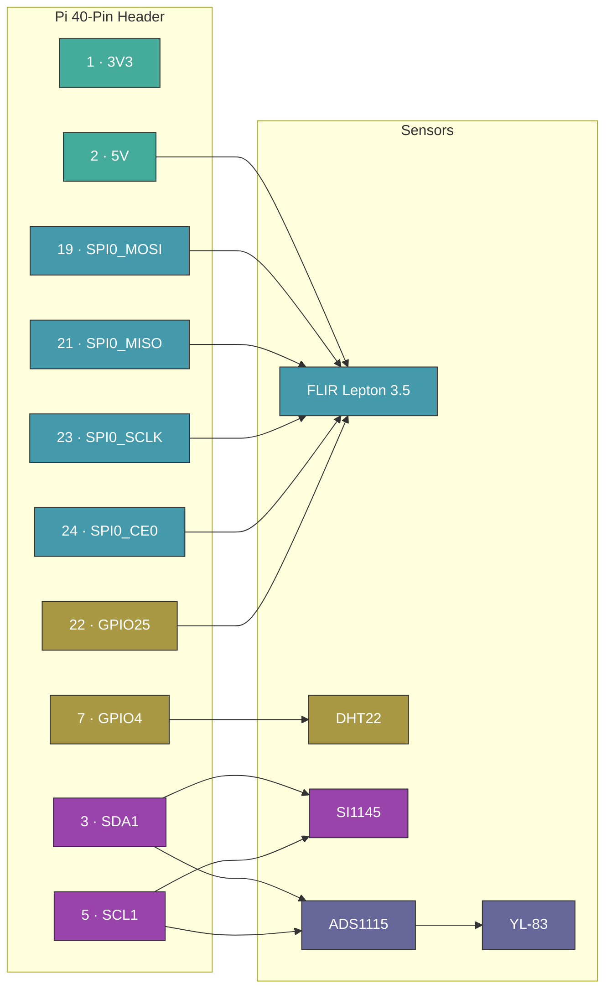

# EMS Line Controller DLR PCB 🌡️⚡


> Sensor HAT for a solar-powered, cellular-connected RTU — mounts to a transmission tower cross-arm, feeds IEEE 738 calculations via [`ems-line-controller-dlr`](https://gitlab.com/arcnode-io/ems-line-controller-dlr)

Solar-powered remote terminal unit (RTU) deployed unattended on transmission tower cross-arms. A small solar panel and LiFePO4 battery keep the Pi running indefinitely. A cellular modem (LTE Cat-M1) publishes sensor data and dynamic ratings to the MQTT broker — no site WiFi or wired backhaul required. The unit is designed for 30-year conductor-adjacent deployment with no scheduled maintenance.

65x56mm 4-layer Pi HAT. FLIR Lepton 3.5 (SPI), DHT22 (GPIO), SI1145 (I2C), YL-83 (ADC via ADS1115). 5V from Pi header, 3.3V LDO for analog front-end. Conformal coated, IP55 when potted inside the field enclosure.

## System Context

```plantuml
rectangle transmission_tower {
  rectangle field_enclosure {
    rectangle dlr_pcb
    rectangle raspberry_pi
    rectangle cellular_modem
  }
  rectangle solar_panel
  rectangle lifepo4_battery
  rectangle conductor
}

queue mqtt_broker
rectangle line_controller_pst

solar_panel -d- lifepo4_battery: charge
lifepo4_battery -d- raspberry_pi: 5V regulated
conductor -u- dlr_pcb: thermal view\n(FLIR Lepton)
dlr_pcb -d- raspberry_pi: 40-pin HAT connector
raspberry_pi -r- cellular_modem: USB / RS-485
cellular_modem -r- mqtt_broker: LTE Cat-M1
mqtt_broker -r- line_controller_pst: tap adjustment commands
```

The PCB is the physical sensing layer of the DLR feedback loop. Every measurement it takes flows through the IEEE 738 calculation in [`ems-line-controller-dlr`](https://gitlab.com/arcnode-io/ems-line-controller-dlr) and ultimately determines whether the phase shift transformer adjusts its tap position.

## Board Spec



## Pinout



## Sensor Interfaces

| Sensor | Interface | Pi Pins | Sample Rate | Measurement | Feeds IEEE 738 Variable |
|--------|-----------|---------|-------------|-------------|------------------------|
| FLIR Lepton 3.5 | SPI0 + VSYNC | 19, 21, 23, 24, 22 | 8.6 Hz (frame) | Conductor surface temp | $R_{thermal}$ |
| DHT22 | GPIO4 (1-Wire) | 7 | 0.5 Hz | Ambient temp + humidity | $T_{amb}$ |
| SI1145 | I2C (0x60) | 3, 5 | 10 Hz | UV / Visible / IR irradiance | $\Delta T_{solar}$ |
| YL-83 → ADS1115 | I2C (0x48) ch0 | 3, 5 | 860 SPS | Rain intensity (0–3.3V analog) | $\Delta T_{rain}$ |

Every sensor reading on this board maps to exactly one term in the IEEE 738 dynamic rating equation:

$$ I_{max} = \sqrt{\frac{q_c + q_r - q_s}{R_{ac}}} $$

## Power Budget

| Rail | Source | Consumer | Typical | Peak |
|------|--------|----------|---------|------|
| 5V | Pi header pin 2 | FLIR Lepton 3.5 | 150 mA | 650 mA (shutter) |
| 5V | Pi header pin 2 | DHT22 | 1.5 mA | 2.5 mA |
| 3.3V | AP2112K LDO | ADS1115 | 0.15 mA | 0.2 mA |
| 3.3V | AP2112K LDO | SI1145 | 3.5 mA | 5.5 mA |
| 3.3V | AP2112K LDO | YL-83 comparator | 5 mA | 8 mA |
| | | **Total** | **160 mA** | **666 mA** |

Peak draw is dominated by the Lepton's shutter event (~500ms every 3 minutes). Pi 5V rail supplies up to 1.5A to HATs — 44% headroom at peak.

## Environmental

| Parameter | Spec | Notes |
|-----------|------|-------|
| Operating temp | -40°C to +85°C | Industrial grade components throughout |
| Conformal coat | Dow Corning 1-2577 | Applied post-assembly, mask connectors |
| Enclosure rating | IP55 (with field enclosure) | Board alone is not rated |
| Vibration | IEC 60068-2-6 (5–500 Hz, 2g) | Transmission tower wind loading |
| Expected service life | 30 years | Matches conductor replacement cycle |
| MTBF | >200,000 hours | Derated per MIL-HDBK-217F |
| Mounting | M2.5 standoffs, Pi HAT spec | 58x23mm hole pattern |

## Fabrication Pipeline

```
 1. uv run poe notebook         → theory.ipynb: power budget + signal integrity
 2. uv run poe build            → SKiDL netlist + schematic
 3. uv run poe sim              → validate LDO dropout, I2C rise time, SPI timing
 4. /generate-schematic         → professional .kicad_sch

    ┌──────────────────────────────────────────────────────┐
    │  HUMAN: open pcbnew, import netlist, save, close     │
    └──────────────────────────────────────────────────────┘

 5. /layout-pcb                 → place + autoroute + ground pour + DRC

    ┌──────────────────────────────────────────────────────┐
    │  HUMAN: review SVG, adjust pcb_placement.yaml        │
    └──────────────────────────────────────────────────────┘

 6. uv run poe validate-asm     → DRC 0 errors
 7. uv run poe generate-asm     → gerbers + BOM + CPL
```

## Layer Stack

| Layer | Use |
|-------|-----|
| F.Cu | Signal — SPI, I2C, GPIO |
| In1.Cu | GND pour (unbroken under FLIR) |
| In2.Cu | 3.3V pour |
| B.Cu | 5V distribution + Pi header |

Unbroken ground plane under the Lepton is critical — SPI runs at 20 MHz and the thermal imager is noise-sensitive. Analog traces from YL-83 to ADS1115 are guard-ringed on F.Cu.

## Project Structure

```
├── pyproject.toml              # Dependencies and build config
├── theory.ipynb                # Power budget + signal integrity derivation
├── sim/
│   ├── model.py                # LDO dropout, I2C rise time, SPI timing
│   └── test_run.py             # Assert simulation matches theory
├── cad/
│   ├── netlist/
│   │   ├── model.py            # Top-level SKiDL circuit
│   │   ├── power.py            # 5V rail + AP2112K LDO
│   │   ├── sensors.py          # FLIR, DHT22, SI1145, ADS1115, YL-83
│   │   └── connectors.py       # 40-pin HAT header + sensor headers
│   ├── layout_spec.yaml        # Schematic block layout
│   ├── pcb_placement.yaml      # Component positions
│   └── drawing-sheet.kicad_wks # Title block
├── output/
│   ├── drawings/               # Schematic SVG + PDF
│   ├── gerbers/                # Fabrication files
│   └── fab/                    # BOM + CPL for assembly
└── readme.md                   # This file
```
