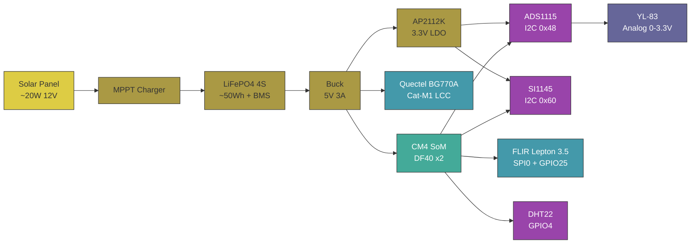
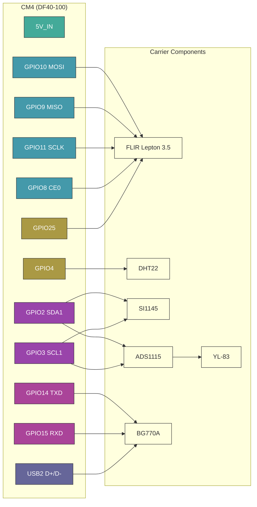

# DLR PCB 🌡️⚡


> Single-PCB CM4 carrier for a solar-powered, cellular-connected RTU — mounts to a transmission tower cross-arm, integrates SoM + cellular modem + IEEE 738 sensor suite + solar/LiFePO4 power management. Feeds [`dlr-operating-envelope`](https://gitlab.com/arcnode-io/dlr-operating-envelope).

Solar-powered remote terminal unit (RTU) deployed unattended on transmission tower cross-arms. A ~20W solar panel and ~50Wh LiFePO4 battery keep the CM4 running indefinitely with cellular PSM idle. A soldered Quectel BG770A (LTE Cat-M1) publishes sensor data and dynamic ratings to the MQTT broker — no site WiFi or wired backhaul required. The unit is designed for 30-year conductor-adjacent deployment with no scheduled maintenance.

~100x80mm 4-layer industrial carrier. Raspberry Pi CM4 (DF40 dual-connector) + Quectel BG770A LCC + FLIR Lepton 3.5 (SPI) + DHT22 (GPIO) + SI1145 (I2C) + YL-83 (analog via ADS1115). MPPT charger from PV input, LiFePO4 BMS, buck for 5V SoM rail, AP2112K LDO for 3.3V analog front-end. Conformal coated, IP55 when potted in field enclosure.

## System Context

```plantuml
rectangle transmission_tower {
  rectangle field_enclosure {
    rectangle dlr_carrier {
      rectangle cm4_som
      rectangle cellular_module
      rectangle sensors
      rectangle power_mgmt
    }
  }
  rectangle solar_panel
  rectangle lifepo4_battery
  rectangle conductor
}

queue mqtt_broker
rectangle dlr_pst_sim

solar_panel -d- power_mgmt: PV input
power_mgmt -l- lifepo4_battery: charge / discharge
power_mgmt -d- cm4_som: 5V / 3V3
conductor -u- sensors: thermal view\n(FLIR Lepton)
sensors -r- cm4_som: SPI / I2C / GPIO
cm4_som -r- cellular_module: UART + USB2
cellular_module -r- mqtt_broker: LTE Cat-M1
mqtt_broker -r- dlr_pst_sim: tap \n adjustment \n commands
```

The carrier is the physical sensing + edge-compute layer of the DLR feedback loop. Every measurement flows through the IEEE 738 calculation in [`dlr-operating-envelope`](https://gitlab.com/arcnode-io/dlr-operating-envelope) and ultimately determines whether the phase shift transformer adjusts its tap position.

## Board Spec



## CM4 Pinout



## Sensor Interfaces

| Sensor | Interface | CM4 Pins | Sample Rate | Measurement | Feeds IEEE 738 Variable |
|--------|-----------|----------|-------------|-------------|------------------------|
| FLIR Lepton 3.5 | SPI0 + VSYNC | GPIO 8, 9, 10, 11, 25 | 8.6 Hz (frame) | Conductor surface temp | $R_{thermal}$ |
| DHT22 | GPIO4 (1-Wire) | GPIO 4 | 0.5 Hz | Ambient temp + humidity | $T_{amb}$ |
| SI1145 | I2C (0x60) | GPIO 2, 3 | 10 Hz | UV / Visible / IR irradiance | $\Delta T_{solar}$ |
| YL-83 → ADS1115 | I2C (0x48) ch0 | GPIO 2, 3 | 860 SPS | Rain intensity (0–3.3V analog) | $\Delta T_{rain}$ |

Every sensor reading on this board maps to exactly one term in the IEEE 738 dynamic rating equation:

$$ I_{max} = \sqrt{\frac{q_c + q_r - q_s}{R_{ac}}} $$

## Anemometer Variants

Single PCB + single firmware binary. Variant lives in the **kit BOM** — sensor,
cable harness, PV panel, and battery differ per SKU. Both sensors speak
NMEA 0183 (`$..MWV`) over RS-485, so the firmware driver is talker-agnostic.

### Kit BOM

| Component | High-wind kit (`DLR-CRN-HW`) | Low-wind kit (`DLR-CRN-LW`) |
|-----------|------------------------------|------------------------------|
| PCB | `dlr-pcb-v1` (same) | `dlr-pcb-v1` (same) |
| Firmware | `dlr-operating-envelope` (same binary) | `dlr-operating-envelope` (same binary) |
| Sensor | Calypso ULP STD | Vaisala WMT702 |
| Sensor wire protocol | NMEA `$IIMWV` over RS-485 | NMEA `$WIMWV` over RS-485 |
| Sensor accuracy (V<2 m/s) | ±5 % + 0.2 m/s offset (1 m/s threshold) | **±0.1 m/s** (0.01 m/s threshold) |
| Sensor op temp | unspecified (consumer-grade) | -10 to +60 °C |
| Cable harness | 5 m bare-wire to M12-5P | 5 m Cannon Trident 19-way to M12-5P |
| PV panel | 20 W | **30 W** |
| Battery | 50 Wh LiFePO4 | **100 Wh LiFePO4** |
| Sticker | `HW-1.0` | `LW-1.0` |
| Kit cost (approx) | ~$650 | ~$2350 |

### When to deploy which variant

Per-site SKU pick uses NREL WIND Toolkit climatology (or customer SCADA wx
history when available). Threshold: fraction-of-year with V_w < 1 m/s
perpendicular to conductor.

| Climatology | Variant | Why |
|---|---|---|
| ≤ 15 % yr V_w < 1 m/s (ridge / coastal / open plain w/ mean ≥ 6 m/s) | high-wind | uplift slice below 1 m/s is marginal; static fallback below threshold is fine |
| > 15 % yr V_w < 1 m/s (valley / sheltered / open plain w/ mean ≤ 5 m/s) | low-wind | uplift slice is material; pay $1.7 k premium to capture it |

### Fallback policy (both variants)

When the sensor reports `void` status, times out, or has a checksum/parse
error, the driver returns `None`. The IEEE 738 layer collapses None →
`V_w = 0.0` → natural-convection-only ampacity = the conductor's static
rating. Same conservative fallback used for the icing-fallback policy.

### Variant power budget

| | High-wind | Low-wind |
|---|---|---|
| Sensor continuous draw | 1 mW | 480 mW |
| System daily energy | 29.1 Wh | 40.6 Wh |
| Winter PV harvest (worst) | 45 Wh | 67.5 Wh |
| Winter margin | 1.55× | **1.66×** |
| Battery autonomy at 0 PV | 1.58 d | **2.22 d** |

Low-wind variant's 30 W / 100 Wh upgrade absorbs the WMT702's higher draw and
restores both winter margin and 2-day autonomy.

## Power Budget

| Rail | Source | Consumer | Idle (PSM) | Typical | Peak |
|------|--------|----------|------------|---------|------|
| 5V | Buck | CM4 | 80 mA | 1400 mA | 3000 mA (boot) |
| 5V | Buck | Quectel BG770A | <1 mA | 100 mA | 250 mA (TX) |
| 5V | Buck | FLIR Lepton 3.5 | 150 mA | 150 mA | 650 mA (shutter) |
| 5V | Buck | DHT22 | 1.5 mA | 1.5 mA | 2.5 mA |
| 3.3V | AP2112K LDO | ADS1115 + SI1145 + YL-83 | 9 mA | 9 mA | 14 mA |
| | | **Total @ 5V equiv** | **240 mA** | **1660 mA** | **3920 mA** |

Daily energy with realistic CM4-always-on idle + 1/min sensor wake + 1/15 min cellular TX: **~29 Wh/day** (derived in `theory.ipynb`). A 50 Wh battery (90% DoD) gives ~1.6 days autonomy with no PV. A 20W panel at 2.5 sun-hours/day (winter Northeast US worst case) delivers ~45 Wh/day after MPPT η — **1.55x winter margin**, 2.5x annual avg.

## Environmental

| Parameter | Spec | Notes |
|-----------|------|-------|
| Operating temp | -20°C to +85°C | CM4 commercial spec; cold-start heater required below -20°C |
| Conformal coat | Dow Corning 1-2577 | Applied post-assembly, mask connectors |
| Enclosure rating | IP55 (with field enclosure) | Board alone is not rated |
| Vibration | IEC 60068-2-6 (5–500 Hz, 2g) | Transmission tower wind loading |
| Expected service life | 30 years | Matches conductor replacement cycle |
| MTBF | >200,000 hours | Derated per MIL-HDBK-217F |
| Mounting | M3 standoffs, 4-corner | Single rigid PCB — no stack |

## Fabrication Pipeline

The project fabricates **two PCBs** (per ADR-013): the main carrier and the Lepton daughterboard. Both go through the same flow.

```
 1. uv run poe notebook         → theory.ipynb: power budget + signal integrity
 2. uv run poe build            → SKiDL netlist (main carrier + daughterboard)
 3. uv run poe sim              → validate buck regulation, MPPT, I2C/SPI timing
 4. /generate-schematic         → professional .kicad_sch (each PCB)

    ┌──────────────────────────────────────────────────────┐
    │  HUMAN: open pcbnew, import netlist, save, close     │
    └──────────────────────────────────────────────────────┘

 5. /layout-pcb                 → place + autoroute + ground pour + DRC

    ┌──────────────────────────────────────────────────────┐
    │  HUMAN: review SVG, adjust pcb_placement.yaml        │
    └──────────────────────────────────────────────────────┘

 6. uv run poe validate-asm     → DRC 0 errors
 7. uv run poe generate-asm     → gerbers + BOM + CPL (per board)
```

## Layer Stack

| Layer | Use |
|-------|-----|
| F.Cu | Signal — high-speed (SPI 20MHz, USB2.0 to BG770A) |
| In1.Cu | GND pour (unbroken under FLIR + cellular module) |
| In2.Cu | Power planes — 5V, 3V3, BAT |
| B.Cu | Signal — low-speed (I2C, GPIO, UART) |

Unbroken ground plane under the Lepton is critical — SPI runs at 20 MHz and the thermal imager is noise-sensitive. USB2.0 to the BG770A is differential-routed at 90Ω matched impedance with GND directly below. Analog traces from YL-83 to ADS1115 are guard-ringed on F.Cu. Cellular antenna is 50Ω microstrip to a u.FL connector.

## Project Structure

```
├── pyproject.toml              # Dependencies and build config
├── theory.ipynb                # Power budget + signal integrity derivation
├── sim/
│   ├── model.py                # Buck regulation, LDO dropout, I2C/SPI timing
│   └── test_run.py             # Assert simulation matches theory
├── cad/
│   ├── netlist/
│   │   ├── model.py            # Top-level SKiDL circuit (main carrier)
│   │   ├── power.py            # MPPT + BMS + buck + LDO
│   │   ├── som.py              # CM4 DF40 connector + decoupling
│   │   ├── cellular.py         # BG770A + SIM holder + u.FL
│   │   ├── sensors.py          # FLIR (FFC), DHT22, SI1145, ADS1115, YL-83
│   │   ├── connectors.py       # Battery + debug + USB-C commissioning
│   │   └── lepton_daughter.py  # Daughterboard SKiDL (Molex socket + FFC)
│   ├── lepton_daughter/        # Second PCB (per ADR-013) — Lepton + bracket
│   ├── schematic/              # /generate-schematic output
│   ├── assembly/               # CadQuery → GLB pipeline (build_assembly.py)
│   ├── layout_spec.yaml        # Schematic block layout
│   ├── pcb_placement.yaml      # Main-PCB component positions
│   └── drawing-sheet.kicad_wks # Title block
├── output/
│   ├── drawings/               # Schematic SVG + PDF
│   ├── gerbers/                # Fabrication files
│   └── fab/                    # BOM + CPL for assembly
└── readme.md                   # This file
```
